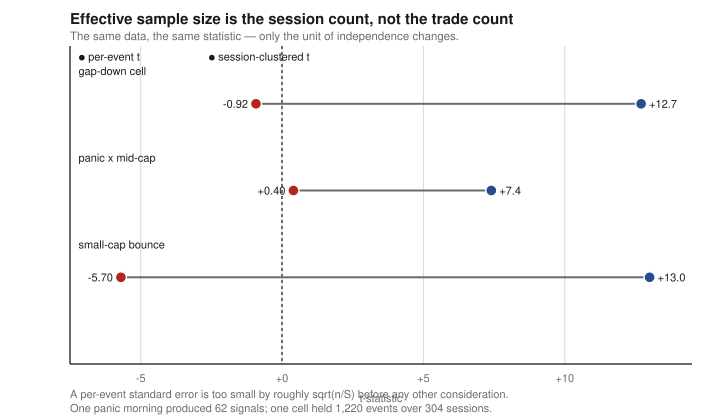

# Methods

The protocol, and the seven traps that produced it. Every rule below exists because a specific
result was wrong before it, not because it is good practice in the abstract.

Magnitudes are given as directions and orders of magnitude rather than exact figures — the
measurement behind each cause of death is withheld on the policy set out in
[docs/DISCLOSURE.md](docs/DISCLOSURE.md).

---

## The funnel

```
idea → graveyard match → mechanism → PIT feasibility → backtest → battery → pre-register → forward
         ↑ stop here if      ↑ stop if none    ↑ stop if the signal
           it matches a        can be stated     is not knowable at
           dead class                            order time
```

Roughly 98 ideas entered. Three reached the end. Most died in the first three boxes, which is
the point — the cheapest kill is the one that happens before any data is loaded.

---

## The seven traps

Each was invented mid-search after a backtest turned out to be false. Each one, at the moment of
its discovery, killed a strategy that was about to be traded.

| # | Trap | How it surfaced | What it changed |
|---|---|---|---|
| 1 | **Data-source verification** | I stopped trusting the field name and put the vendor's "open" field next to the chart by hand. It was not the opening price | The first paper trade was reported profitable and was not. An independent daily audit with three-source cross-checking became permanent |
| 2 | **Day-clustered t** | One cell showed a per-trade *t* above 7; grouping by session collapsed it to under 1 | An entire pattern family, and the headline statistic of every test thereafter |
| 3 | **Survivorship quantification** | A delisted name does not fail in the panel, it leaves it — so I collected 185 of them and recomputed the same events | The largest statistic of the search changed sign. It was the search's largest artifact |
| 4 | **Limit-up fill check** | The one candidate to survive a whole search — an independent recount found part of its signal set sat on limit-up closes, which cannot be bought | Removing them wiped it out. A fill check became mandatory in every test |
| 5 | **Ghost-leg test** | A futures fade used a signal that confirms *at* the price it claims to enter | Recomputed on the executable leg it lost significance. Only post-confirmation reachable prices allowed thereafter |
| 6 | **Mirror test** | To check whether a bounce was an artifact, the same brackets were applied to the opposite extreme | The mirror faded hard, confirming the directional structure was real — a case where the trap *validated* rather than killed |
| 7 | **Deflation accounting** | Cells were counted cumulatively as the search ran, into the thousands | Made explicit that mid-3 *t* "candidates" were sitting in the noise expectation |

---

## Rules

### Pre-register, and do not re-grid

A rule is frozen with its filters, its judgment horizon, its kill line, and its multiplicity
count, before out-of-sample data exists. The freeze document carries the line *"no re-gridding —
touching a parameter after this freeze re-explodes k."*

This is enforced against myself. During this repository's construction I split an already-frozen
rule along a dimension that had not been part of the freeze, and found a materially better cell
that survived drop-top-day and cleared its nominal significance bar at the width of the new split.
It was **recorded and not adopted**, because the honest *k* is not the width of the new split — it
includes the 1,021-cell search that came before, and that search had already returned a corrected
p of 1.0000.

The cell's numbers are not published, and that is deliberate. Publishing them would invite an
argument about whether that particular cell is real, which is the wrong argument: the principle
does not depend on the cell, and a working refinement given away for rhetorical effect is a poor
trade.

A frozen rule may also **not be judged on the data that produced it**, and re-fitting a frozen
baseline afterwards is itself look-ahead.

### Forward testing is a catastrophe detector

Not a confirmation device. At the event rate of the confirmed strategy, reaching a day-clustered
t above 2 forward would take on the order of a thousand trades — roughly **7.5 years**. So the
pre-registered lines are kill lines only, and **there is no confirm line anywhere**.

The *derivation* is the publishable part: lines were set from the pre-freeze distribution at four
sample sizes, before any forward observation existed —

$$
L(n) \;=\; \hat\mu_{\text{pre}} \;-\; z_q\,\frac{\hat\sigma_{\text{pre}}}{\sqrt{n}} .
$$

The four values are withheld, because thresholds indexed by $n$ *are* this curve — two points
determine $\hat\sigma_{\text{pre}}$, and combined with a published mean the whole return
distribution falls out. Shape and reasoning in
[MODELS.md](MODELS.md#kill-lines-as-sigma-over-root-n-quantile-curves).

The discipline this enforces is easy to state and hard to follow: an early forward reading below
the backtest mean, at a sample size in the single digits, excludes almost nothing. Reporting it as
evidence against the strategy would be as much a misuse of the sample size as reporting a good one
as confirmation.

Corollary: **never choose a test that needs data you cannot get.** A distributional duel needed
n ≈ 2,844 market-days (~8 years) at the observed paired standard deviation; a narrower premium
question was decidable at n = 34. Pick the answerable question.

### Cluster on sessions

Effective sample size is the session count, not the event count. One panic morning produced 62
signals; one cell had 1,220 events across 304 sessions. The estimator groups events by session,
averages within, and tests the session means:

$$
t \;=\; \frac{\bar m}{\hat\sigma_m/\sqrt{S}},
\qquad
\bar m = \frac{1}{S}\sum_{s=1}^{S}\bar x_s .
$$

The $\sqrt{S}$ rather than $\sqrt{n}$ in the denominator is the whole correction — with events
clustered, the naive standard error is too small by roughly $\sqrt{n/S}$, about a factor of two
for the cell above. Full treatment in [MODELS.md](MODELS.md#session-clustered-t). Report
`n_sessions` beside every statistic — see
[`day_clustering.py`](src/features/falsification/domain/services/day_clustering.py), which
raises rather than returning a number when given a single session.



### Judge at a fixed realistic cost

0.38–0.40% round trip, always, regardless of what a candidate's own specification proposes.

This is not paranoia about parameters. An earlier revision of my search code **lowered its own
declared cost** to 0.25 in order to produce a `retail_tradable` verdict. Cost is no longer an
input the candidate controls. The same revision read the out-of-sample lock-box and threw
**17 mutually 0.83-correlated bets** at the same fixed tail, so the OOS split
is now frozen and consumed exactly once, by a separate finalisation step, on one pre-registered
specification.

> The harness has to audit itself too.

### Count the search

Log the cell count with every result and compare the winner against the expected maximum of that
many pure-noise draws, not only the nominal bar:

$$
\mathbb{E}[M_k] \;=\; \sqrt{2\ln k} \;-\; \frac{\ln\ln k + \ln 4\pi}{2\sqrt{2\ln k}} \;+\; O\!\left(\frac{1}{\ln k}\right).
$$

The implementation uses the leading term, which is the bound *generous to the candidate* — a
result that fails against $\sqrt{2\ln k}$ fails against the sharper expansion too. The nominal
bar passes noise maxima: at k ≈ 54–80 the ceiling is 2.82–2.96, and a 92-hypothesis search
returned survivors at 2.92. Derivation in [MODELS.md](MODELS.md#the-noise-ceiling--sqrt2-ln-k); code in
[`multiplicity.py`](src/features/falsification/domain/services/multiplicity.py).

### Separate beta from alpha

Raw return answers "did capital survive". Beta-adjusted excess answers "is the strategy working".
They are different questions and a stop rule that conflates them sells the bottom. A stop
requires **both** to breach; beta is set *below* the measured value so that the "blame the
market" defence is harder to invoke, not easier; and a missing index observation propagates as
`None`, never as zero.

### Label every claim

`[F]` measured here · `[C]` cited, source required · `[E]` estimated, reasoning required ·
`[A]` assumed, untested.

A quantitative conclusion may not be drawn through an `[A]` link. Five assumptions each 50%
likely produce a 3% conclusion, and the failure mode is stating it with full confidence. When the
chain contains an `[A]`, the honest output is a measurement plan.

Corollaries learned by getting them wrong: a backtest result is **not automatically `[F]`** until
look-ahead and fill feasibility are checked; a cited research report that is itself a stack of
estimates stays `[E]` when quoted; and a range like "+15–40%" is not safer than a point estimate,
it is two unverified point estimates with the uncertainty hidden between them.

---

## What the automated battery cannot do

The harness gates are: look-ahead audit · independent recompute · placebo · random null ·
walk-forward · cost floor · beta decomposition · decay · deflated significance.

**No gate detects fill fantasy, instrument absence, or adverse selection.** Those three — which
together account for the majority of kills in this repository — were all found by hand, by
placing real orders and watching them not fill.

That is why `survives_alpha` and `retail_tradable` are separate fields on the verdict rather than
one score. In the shipped ledger, seven hypotheses are true on the first and **zero** on the
second.

---

## Where automation is forbidden

Automated search is allowed where the verifier is honest — a parser either round-trips or it does
not, a reconciliation either balances or it does not, `pytest` is either green or it is not. In
that setting an unattended loop is just a fast way to reach a fixed point.

It is **not** allowed for strategy discovery, parameter search, or anything of the form "raise the
Sharpe". There the success metric *is* the research question, so optimising it is Goodharting. A
loop scored on the number it is trying to estimate will find the cheat rather than the edge, and it
will not remember that the cheat was already rejected once.

> Backtest P&L is not an honest verifier.

---

## Silent failure

The dominant bug class in the parent system was not wrong logic. It was **quiet no-action**:
code that failed, logged success, and returned a plausible value.

The canonical instance: on a session where the index fell −6.12% against a −1.5% threshold, two
strategies both failed to enter. Root cause was a rate limit, but it was *invisible* because a
fallback built `{"flu_rt": ...}` while the consumer read `flu_rt_n` — so the fallback had never
worked since deployment — and the guard read `if value is None or value > threshold: skip`,
which renders "missing" and "condition not met" identical. An adversarial audit found **13
instances** of the same shape; 9 were fixed.

Five patterns to check for, and the reason `errors.py` in this repository raises rather than
returning defaults:

1. A fallback produces a key, type, or unit the consumer does not read
2. `except: pass` leaves no trace
3. Missing (`None`) and condition-not-met (`False`) are handled on the same branch
4. The log claims success but the return value is never consumed
5. A helper returns a plausible value — first element, `0`, `{}` — instead of raising

And: **static analysis and unit tests systematically miss this class.** Two of the three worst
instances were found only by running the real entry point against a fake socket on a virtual
clock. Fixtures must mirror production schemas, or a dead branch survives its own test.
