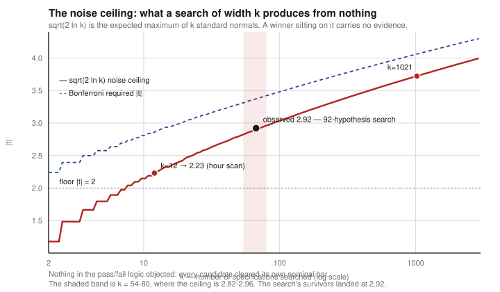

# kosdaq-research

[](https://github.com/wonsang2003/kosdaq-research/actions/workflows/verify.yml)
[](LICENSE)

> My best backtest reached a Newey–West **t of 48** across thirteen consecutive profitable years.
> It filled **zero of twenty** live orders, and took **0% allocation across thirty-two closing
> auctions**. It is in the graveyard.

A single-operator research stack for Korean equities, run on my own capital. **~98 pre-registered
hypotheses** across KRX equities, crypto arbitrage, Korea-stock perpetuals and prediction markets.
**Three survived.**

This repository is the machinery and the record: the estimators that decide whether a result is
real, the execution models that decide whether it is reachable, and a classified account of the
ninety-five that failed. It runs offline, with no credentials.

---

## The question every result has to answer

Search a wide enough grid and something clears any fixed bar. The maximum of $k$ independent
standard-normal draws grows like

$$
\mathbb{E}[M_k] \;=\; \sqrt{2\ln k} \;-\; \frac{\ln\ln k + \ln 4\pi}{2\sqrt{2\ln k}} \;+\; O\!\left(\tfrac{1}{\ln k}\right),
$$

so a "significant" statistic means nothing until it is read against the width of the search that
produced it. Every candidate here is placed on this curve before it is believed.



The rightmost point is my own: a 92-hypothesis search whose survivors landed almost exactly on the
ceiling for their grid widths. Nothing in the pass/fail logic objected — each candidate had cleared
its nominal bar. [Derivation](MODELS.md#the-noise-ceiling--sqrt2-ln-k) ·
[implementation](src/features/falsification/domain/services/multiplicity.py).

---

## Run it

No credentials, no network, no broker account.

```bash
make setup      # once
make run        # replay the shipped panel end to end and judge it
```

```
strategy         Hour-13 relative-turnover rank  [REFUTED]
sessions         20          <- the effective sample size
day-clustered t  -3.43
drop best day    -0.499%  t -3.87

LOSES, and significantly so.
```

The shipped default is a rule I selected on a training fold and that failed out of sample; the
runtime prints `REFUTED` before it runs. `make verify` runs **407 tests**, `make audit` replays a
documented finding from the original result file in about a second, and CI repeats all of it on a
machine that is not mine and in a timezone that is not Seoul.

---

## The estimators

Each one is defined, derived where the derivation matters, linked to the code that runs it and the
test that pins it, in **[MODELS.md](MODELS.md)**.

| Question | Estimator |
|---|---|
| Is the sample as large as it looks? | Session-clustered $t = \bar m / (\hat\sigma_m/\sqrt{S})$ — events on one day are one observation |
| Is this the maximum of a search? | $\sqrt{2\ln k}$ noise ceiling · Bonferroni · Šidák $p_{\text{corr}} = 1-(1-p)^k$ |
| Would a null do as well? | Empirical-null placebos — random days, shuffled volume, random signals |
| Does it survive its own best day? | Drop-top-session influence · block bootstrap |
| Does selection carry information? | Train/test rank correlation across the candidate set, before any winner is picked |
| Can the price be obtained? | Auction-allocation and fill-feasibility predicates; participation-capped capacity |
| Is the edge bigger than the friction? | Fixed round-trip cost floor, with break-even treated as endogenous to selection |
| Is it alpha or exposure? | $\text{excess} = r - \beta r_m$, reported at the sign-flip $\beta_{\text{flip}}$ rather than a point estimate |
| When do I stop? | Kill lines as $\hat\mu - z_q\,\hat\sigma/\sqrt{n}$ quantile curves, frozen before the data |


Clustering is the correction that killed the most candidates. A statistic computed per trade
inflates by roughly $\sqrt{n/S}$ when the trades share sessions, which on a panic morning is a
factor of several.

---

## Selection is the adversary

Twelve configurations, split into train and test. I picked the best on train and wrote it into a
strategy.


It ranked **eighth of twelve** out of sample, every configuration lost money, and train explained
almost nothing about test. The file that would have stopped me had already been written by my own
scanner — I had read the wrong column. [The autopsy](docs/postmortems/04-train-selection-hour-scan.md)
runs from the shipped artifact with `make audit`.

Six more are in **[docs/postmortems/](docs/postmortems/)** — three are defects in my own
measurement code rather than in a market, and one is
[the most accurate model I built](docs/postmortems/07-the-most-accurate-model-was-unusable.md),
walk-forward AUC 0.909, worth nothing because its discrimination sat entirely where no order
fills.

---

## How hypotheses die

Eleven causes, extracted from the record and used as a screen: a new idea that matches one is not
backtested at all. Full list with every strategy and its cause in **[GRAVEYARD.md](GRAVEYARD.md)**.

| | |
|---|---|
| **Fill fantasy** | The backtest transacted at a price the queue never offers. The most common death by a wide margin |
| **Cost floor** | The signal is real and smaller than the tax |
| **Survivorship manufacture** | The edge was the absence of delisted names |
| **Multiplicity** | The reported figure is the maximum of a search, not an estimate |
| **Regime concentration** | One market state, dominating the sample |
| **Unobservable at decision** | The conditioning variable is not knowable when the order must be placed |
| **Instrument absent** | Real, reachable in principle, and no instrument exposes it to this participant |
| **Beta disguise** | Market or style exposure reported as alpha |
| **Adverse selection** | Fills are obtainable; the subset that fills is the subset that loses |
| **Deployable-universe restriction** | Every gate passes, and the alpha lives in names you would never deploy into |
| **Nothing there** | No effect survived first contact |

**The finding that generalises: fillability and edge are mutually exclusive.** Confirmed six times
across three markets, most directly by measuring the orders that could *not* be filled against the
ones that could — the unreachable set was several times better. Predictive power concentrates
exactly where the queue does not clear, which is why every fill claim here is checked before any
significance test is reported.

Three of ~98 is the expected outcome of an honest search, not a poor one.

---

## Market constraints that decide most of this

| | |
|---|---|
| **±30% daily limit** | Price cannot trade beyond ±30% of the previous close. The ceiling is that price floored onto a widening tick grid, which makes the return from any entry premium to the ceiling an exact affine function — arithmetic, not a forecast |
| **0.20% sell-side tax** | Round trip ≈ 0.38%. The binding term in most Korean cost-floor deaths |
| **No retail borrow** | A live lendable-securities query returned nothing on KOSDAQ. Every short-side result in this repository is unreachable for the account that produced it |
| **09:00 / 15:30 auctions** | Single-price call auctions with pro-rata allocation, not a queue. This is where the best backtest died |

**[docs/institutional-delta.md](docs/institutional-delta.md)** takes six corpses and names the
capability that reverses each one. Several are dead only for a retail account.

---

## What I do not publish

Three strategies survived and are live. Their signal definitions, entry and exit rules, holding
periods, filter sets and parameter values are **withheld** — as is the measurement behind each
cause of death in the graveyard, which is the part that took the time.

Published instead: mechanism at class level, the falsification checks each survivor had to pass,
the wounds found in each, and the pre-committed conditions under which each would be abandoned.
The policy is in **[docs/DISCLOSURE.md](docs/DISCLOSURE.md)**; the survivor sheets are in
**[docs/survivors/](docs/survivors/)**.

The survivors section is one page and the graveyard is the rest of the repository. That asymmetry
is the finding, not an omission.

---

## Layout

```
src/
├── shared/domain/            Basis(F/C/E/A) · Ticker · TradingDay · KRX tick grid · clock
├── features/
│   ├── hypothesis/           Hypothesis · EdgeMechanism · CauseOfDeath · ledger
│   ├── falsification/      ★ Verdict · multiplicity · day-clustering · beta separation
│   ├── preregistration/      FrozenRule — mutation raises, no confirm line exists
│   ├── execution_realism/    fill feasibility · participation rate
│   ├── market_data/          Bar · MarketDataSource · BarStore · replay source
│   ├── strategy/           ★ the boundary the alpha does not cross
│   ├── execution/            Order · Broker · OrderJournal — replay rebuilds state
│   └── operations/           scheduler · kill switch · trading mode · logging
└── app/                      composition root · use cases · CLI
```

Domain entities are `pydantic` models; repositories are ABCs declaring their return *and raise*
semantics. Pure statistics stay plain functions.

Research and backtest code only — live order routing, credentials and deployment configuration are
not here. Research logic was copied out of the production system, never cut, and the two are pinned
together by equivalence tests that **fail rather than skip** when the original is absent.
Reproduction details in **[VERIFICATION.md](VERIFICATION.md)**; protocol in
**[METHODS.md](METHODS.md)**.

---

*Not investment advice. Aggregate research results only; no client, account or position data.*
