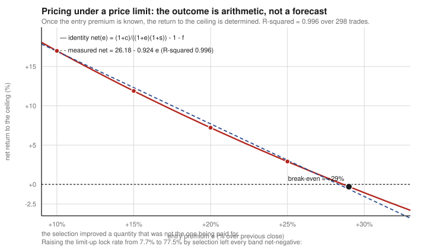

# Postmortem: LOCK — the best backtest in the repository

**Verdict:** RETIRED · **Cause of death:** fill fantasy · **Cost to discover:** ~10 trading days
of live orders

---

## The claim

Buy KOSDAQ stocks that close at the limit-up price (상한가) in the closing auction; sell into the
next morning's opening auction.

| Metric | Value |
|---|---|
| Net per trade | **+6.05%** |
| Newey–West t | **48.0** |
| Profitable years | **13 / 13** |
| Win rate | **77%** |
| Delisted names included | yes |

This is the strongest result in six weeks of work across four markets. It is not fragile: it
survives delisted-panel recomputation, both half-samples, drop-top-days, and a placebo. The
mechanism is real and well documented — limit-up closes reflect delayed price discovery under a
±30% cap, and the discovery completes overnight. The symmetric mirror confirms it: a limit-down
close is followed by **−5.87% (t = −11.7)** the next day.

Every part of that is true. The strategy is still worthless.

---

## What killed it

**20 live orders over 10 trading days. 0 filled. 0% allocation across 32 closing auctions.**

The KRX closing auction is a single-price call auction with pro-rata allocation. At the limit-up
price the buy queue is, by construction, enormous — everyone who wants the stock wants it at
exactly that price, and no one is selling into a print that has been bid to the cap. A retail
order of ₩1M joins a queue against institutional size and receives an allocation
indistinguishable from zero.

The backtest transacted at the closing price. That price existed. It was not available.

---

## Why the backtest could not have seen it

Nothing in the data was wrong. The closing price is the closing price, the next open is the next
open, and the return between them is exactly +6.05%.

The missing variable is not in the price series at all. It is *auction allocation*, which is a
function of queue depth at the limit price, and daily OHLCV contains no queue. There was no
statistical test available on that data that would have caught this, because the failure is not
statistical.

This is what separates the class from ordinary overfitting. An overfit strategy has a signal that
does not generalise. LOCK has a signal that generalises perfectly and a price that does not
exist for this participant.

---

## Confirmations from the same class

Once the pattern was named, it appeared everywhere:

- **2-consecutive-green overnight** — the only survivor of an entire separate search at t = 4.0.
  1.17% of its signals were limit-up closes. Removing them: **t = −0.16**.
- **Soft-lock overnight**, built specifically to fix this — trade the *fillable* names just below
  the cap instead. The +6.3% near-cap return turned out to be entirely the pinned subset
  (close == high == locked). The fillable subset of the same band: **−1.5%, t = −2.68**.
  Fillability and edge are not merely uncorrelated here; they are mutually exclusive.
- **Gap-down bounce** — 14 of 14 live orders unfilled, and then shown to be *statistically
  normal*: P(realised gap ≤ −7% | expected ≤ −7%) = 7.3%, so 14 consecutive misses has
  probability 34.8%. The unfilled orders were the design working, not breaking.

---

## What would revive it

Stated so the claim stays falsifiable. LOCK becomes tradable if **any** of these hold:

1. **Allocation data contradicts the observation.** 32 auctions is a small sample. If a larger
   sample showed non-zero allocation at some size or on some subset of names, the arithmetic
   changes. Falsifier: 100+ auction attempts with recorded allocation ratios.
2. **A participant with auction priority runs it.** Nothing here says the edge is not real for a
   member firm. The finding is specific to a retail account's position in the queue.
3. **The cap changes.** The entire mechanism is a consequence of the ±30% limit. A different
   limit, or a volatility-scaled one, would need the whole analysis re-run rather than adjusted.

What would *not* revive it: a better signal, a filter, a machine-learning gate, or a larger
sample. The constraint is not in the signal.

---

## The test that pins this

[`tests/test_market_arithmetic.py::test_ceiling_return_is_determined_by_entry_premium_alone`](../../tests/test_market_arithmetic.py)

It asserts the related arithmetic for the intraday version of the same idea: once you know the
entry premium, the return to the ceiling is determined, with **R² = 0.996** measured across 298
real orderbook trades. It fails if anyone reintroduces a model that claims to predict that
quantity.

---

## What I take from it

The headline number of a research programme is the number most likely to be an artifact,
because the search that produced it was optimising for exactly that. A t-statistic of 48 should
have been treated as an alarm from the first sight of it, not a result. It was three weeks
before anyone tried to buy the thing.

The cheap test — place twenty orders — was available on day one and cost nothing.
