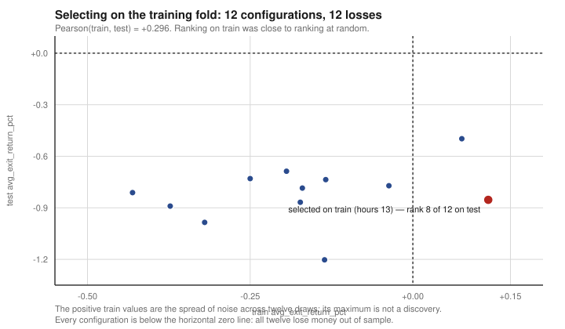

# Postmortem: twelve configurations, twelve losses, and I picked the eighth-best

**Verdict:** REFUTED · **Cause of death:** multiplicity / train-selection ·
**Reproduce it:** `python3 scripts/replay_hour_scan.py` — stdlib only, no credentials, under a second

---

## The question

The scanner ranked KOSDAQ names intraday. The open question was which hour of the session to
trade. I evaluated twelve configurations — single hours and small combinations — split into a
training and a test fold, and selected the one that performed best in training.

`hour == 13` won on train at **+0.116%** per trade after cost. It went into the strategy.

## What the same file says about the test fold

```
  hours          train      test  rank tr  rank te
  ------------------------------------------------
  13            +0.116    -0.854        1        8   <-- selected on train
  11            +0.075    -0.498        2        1
  14,13         -0.037    -0.771        3        5
  10,11         -0.134    -0.736        4        4
  15            -0.136    -1.203        5       12
  14,09,13      -0.170    -0.785        6        6
  14,15         -0.173    -0.868        7        9
  14            -0.194    -0.687        8        2
  12            -0.250    -0.730        9        3
  10            -0.320    -0.985       10       11
  09,10         -0.373    -0.890       11       10
  09            -0.431    -0.812       12        7

  Configurations losing money out of sample: 12 of 12
  Pearson(train, test) across configurations: +0.296
```

Three things, in ascending order of how much they matter.

**The selected configuration ranks 8th of 12 out of sample.** Rank 1 became rank 8. On its own
this reads as bad luck.

**Every configuration loses money out of sample.** All twelve. There was no hour to pick. This is
the finding: I was not choosing between a good hour and a bad hour, I was choosing which negative
number to write into the code.

**Train and test correlate at +0.296.** This is the one that makes it structural rather than
unlucky. A selection criterion that correlates 0.3 with the objective is not a weak method — it is
close to no method. Ranking twelve configurations on train and taking the top one was, to a good
approximation, ranking them at random.

## What the positive training numbers were

Two configurations were positive on train, at +0.116% and +0.075%. Both are small; both are inside
the spread you get from drawing twelve samples from a distribution centred slightly below zero.
Taking the maximum of that spread and calling it a discovery is not a mistake in the arithmetic,
it is a misunderstanding of what a maximum is.

The general form, which this repository applies everywhere since: compare the winning statistic
against the expected maximum of $k$ pure-noise draws,

$$
\mathbb{E}[M_k] \approx \sqrt{2\ln k}, \qquad \sqrt{2\ln 12} = 2.23 .
$$

Nothing here came close to clearing 2.23, and nothing needed to, because the sign alone settles
it. Derivation in [MODELS.md](../../MODELS.md#the-noise-ceiling--sqrt2-ln-k).



## Why this file is in the repository

It is my own scanner's output, unmodified, and it refutes my own strategy. It cost nothing to
produce — the pipeline computed the test-fold column at the same time as the train column, and I
selected on the wrong one. The number that would have stopped me was already in the file.

It also makes the repository's central claim checkable rather than asserted. Everything else here
argues that selecting on the evaluation set manufactures results. This one runs in a second and
shows it happening to me.

## What would change my mind

- **A configuration positive out of sample.** There is none in this file; if the fold split were
  redrawn and some appeared, the conclusion would need re-deriving rather than adjusting.
- **A train/test correlation materially above zero on a larger configuration set.** 0.296 at
  k = 12 is itself an estimate with wide error bars. It would not rescue *this* result — all twelve
  are still negative — but it would change whether train-selection is defensible in general here.

What would **not** change my mind: more hours, finer time buckets, or a filter on top. Those
increase k, which raises the bar, and the bar is already unmet.

## The tests that pin this

[`tests/test_audit_artifacts.py`](../../tests/test_audit_artifacts.py):
`test_every_configuration_loses_money_out_of_sample`,
`test_train_selected_config_ranks_eighth_of_twelve_on_test`,
`test_train_carries_almost_no_information_about_test`.

## What I take from it

The evaluation fold is not a scoreboard. The moment it is used to choose between candidates it
becomes a second training set, and there is nothing left to evaluate on.

The cheap protection is procedural rather than statistical: **select on train, report on test, and
if the report is bad, say so.** I had built exactly that pattern elsewhere in the same codebase —
one module selects exit parameters on train and evaluates on test, correctly. I simply did not
apply it here, which is the more uncomfortable finding, because it means the knowledge was present
and the discipline was not.
