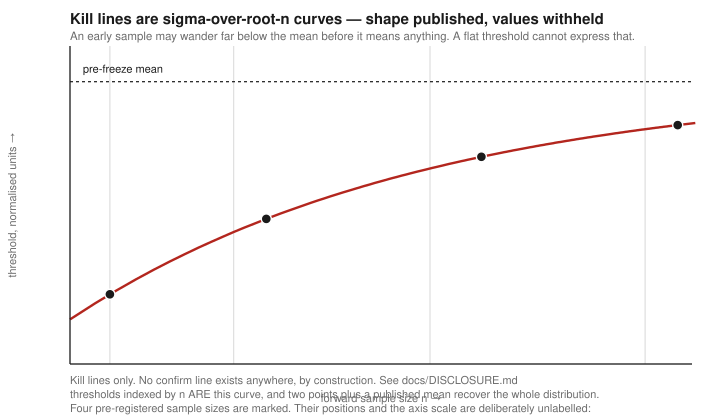

# S1 — corporate-action event, long

**Status:** live, own capital · **Verdict:** CONFIRMED · **Disclosure tier:** see [DISCLOSURE.md](../DISCLOSURE.md)

A complete spec sheet with one field withheld. Everything needed to judge whether the work is
sound is here; the line that would let you run it is not.

---

## Specification

| Field | |
|---|---|
| Universe | KRX, both boards, no sector restriction |
| Direction | Long only |
| **Signal definition** | **WITHHELD — live** |
| **Entry rule** | **WITHHELD — live** |
| **Exit rule** | **WITHHELD — live** |
| **Holding period** | **WITHHELD — live** |
| **Filter set** | **WITHHELD — live** — three filters, all applied at signal time |
| Signal fixed at | The evening before the trading decision. Nothing intraday is used |
| Execution, both legs | Prices set by exchange procedure rather than by a discretionary order |
| Cost applied | 0.38% round trip, fixed, not a tunable |
| Sizing | Equal weight, participation-capped |

Withheld fields are available under NDA or in an interview.

## Mechanism

A statutory corporate-action filing carries a committed cash component. The counterparty is
disclosure-driven retail flow.

The mechanism is a **committed corporate cash flow, not a price pattern**, which is why it could be
written down before the test rather than fitted after it. That distinction is load-bearing: an edge
you cannot explain also disappears without explanation, and this repository contains several that
did.

## Why it survived when ninety-five did not

Both legs transact at a price the exchange determines procedurally. There is no queue to lose and
no discretionary price.

The most replicated finding in this repository is that **fillability and edge are mutually
exclusive** — confirmed six times across three markets, most directly by measuring the orders that
could not be filled against the ones that could, and finding the unreachable set several times
better. This strategy is the
exception, because its fill is definitional rather than contested. That is the whole of why it is
here and the others are not.

## Evidence

| | |
|---|---|
| Span | 11.5 years |
| Day-clustered t | **5.07** |
| Calendar years positive | **12 of 12** — signs only: `+ + + + + + + + + + + +` |
| Net edge after the fixed 0.38% round trip | a low single-digit multiple of the cost floor |
| Placebo (random-day control) | real minus placebo is a clear positive margin; the control is not near the signal |
| Robustness | survives drop-top-days; both half-samples positive |

Event count and per-trade magnitude are withheld. Event frequency is itself an identifier for the
underlying filing type — count filings per year by category against the public disclosure system
and a published frequency matches one of them. This is the one statistic here that is not reported
as a ratio, and the reason is specific rather than reflexive.

## The check that mattered most

Recomputed on a 185-name delisted panel, the edge **moved by under 5% of itself**.

A gap-down strategy tested in the same session, under the same recompute, lost **60%** and ended
sign-undetermined. Same check, same data, opposite outcome.

That asymmetry is the strongest evidence here that the result is not survivorship manufacture, and
it is reported as a ratio precisely so it can be read without disclosing levels. A single "it
passed" would be worth much less — the comparison is what makes it informative.

## Two wounds, both load-bearing

**Capacity was overstated by roughly 69×.** The backtest's participation denominator was daily
volume, against an entry that happens in an auction. Measured against the correct denominator, a
10% participation cap cuts realised value per trade by **39%**, and about 30% of the sample violates
that cap outright. Found *after* pre-registration and recorded rather than repaired — repairing it
retroactively would have meant re-fitting a frozen rule.

**Forward testing cannot confirm it.** At the observed event rate, reaching a day-clustered t above
2 forward would take the better part of a decade. The
pre-registered lines are therefore **kill lines only**, and there is no confirm line, by design.
Their derivation is publishable — set from the pre-freeze distribution at four sample sizes — and
their values are not: thresholds indexed by $n$ trace the curve
$L(n) = \hat\mu - z_q\,\hat\sigma/\sqrt{n}$, and the identity
$t = \bar x\sqrt{n}/\hat\sigma$ means that of the triple (mean, $t$, $n$) **any two determine
the third along with $\hat\sigma$** — which is why this document never publishes all three.

## Why the edge exists at all

Too few entry-days per year, in names too small for institutional capacity to bother with. This is
a rare case where the edge is available because the hand is **small**, not because it is fast — and
it is the reason the capacity wound above is a real constraint rather than an academic one.

## What would change my mind

Committed in advance, so that a bad outcome cannot be renegotiated later:

- **The pre-registered kill lines being breached at any of the four sample sizes.** Not "reviewed",
  breached. The rule is retired.
- **The delisted-panel recompute moving the edge by more than a quarter of itself** on a larger
  panel than the 185 names currently available. The gap-down comparison above is only meaningful
  while the asymmetry holds.
- **The auction fill assumption failing in practice** — any measured allocation shortfall on the
  entry leg moves this strategy into the same class as the one at the top of the graveyard, and the
  argument for it collapses entirely rather than degrading.
- **The mechanism ceasing to hold** — a regulatory change to the filing regime would invalidate the
  thesis directly, and the correct response would be to stop rather than to re-fit.

What would **not** change my mind: a run of losing trades inside the kill lines. That is what the
lines are for, and moving them because they were approached would make the pre-registration
worthless.
